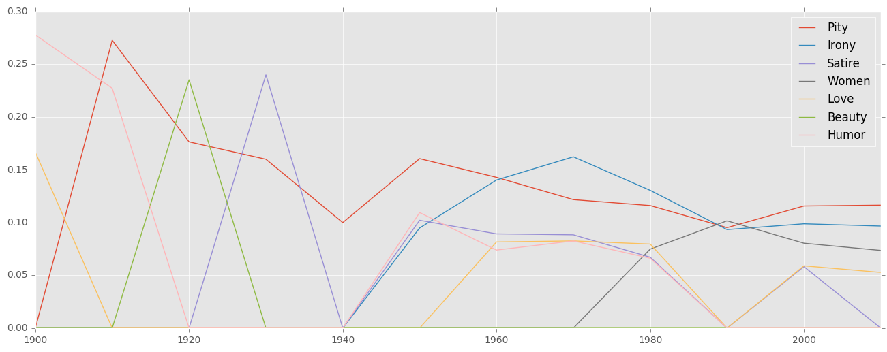
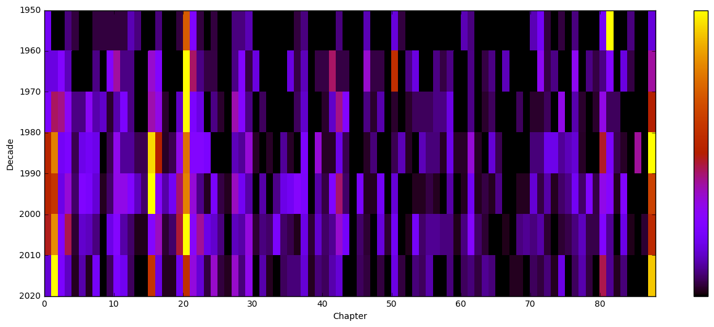

"If we had a keen vision and feeling of all ordinary human life," the narrator of George Eliot's _Middlemarch_ argues, "it would be like hearing the grass grow and the squirrel's heart beat, and we should die of that roar which lies on the other side of silence" [@maertz_middlemarch_2004 180]. This sentence is among the most quoted from the novel, appearing in over fifty-six critical articles. What is it about this passage that has made it so quotable? The following describes an experiment in the quantitative analysis of literary criticism surrounding _Middlemarch_, where we attempt to answer this question. Using text reuse detection techniques, we identify the passages of the novel that are most cited by critics, and patterns in the way these passages shift over time. We study the differences in citations between George Eliot specialists and other literary critics, along with other such demographic trends. Finally, we look for patterns in the language of the quotations themselves, in an attempt to discover syntactic and lexical criteria that make a passage likely to be cited.

This study is by no means the first of its kind. @goldstone_quiet_2014 analyze 21,367 articles spanning over a century and seven literary critical journals. Among their observations are a decrease in the use of numbers over the twentieth century, and an increase in themes of death and violence. The [Viral Texts](http://viraltexts.org/) project [@smith_infectious_2013] maps journalistic text reuse in 19th-century newspapers, and the recent [Digital Breadcrumbs of Brothers Grimm](http://www.etrap.eu/digital-breadcrumbs-of-brothers-grimm/) project computationally detects text reuse of Brothers Grimm material. Dennis @tenen_digital_2017 has recently used extracted citations in an analysis of the journal _Comparative Literature_. JSTOR Labs, in their [Understanding Shakespeare](https://labs.jstor.org/shakespeare/) and [Understanding the Constitution](http://labs.jstor.org/constitution-site/) projects, construct electronic editions of these texts that denote the number of quotes, and the quoting entities, from each journal in their database. We are indebted to each of these projects for their methodological ingenuity. 

George Eliot's novel _Middlemarch_ is an unusually apt novel for this study, since as a canonical text that is so self-consciously aphoristic, it is both highly quotable and often quoted. Leah Price notes that it has been “more ruthlessly excerpted than any [novel] since: chopped into anthology-pieces, recycled as calendar decorations, used to test army officers, deployed in a Zionist tract, plastered onto billboard, and quarried for epigraphs to a socialist treatise and even an abridgement of Boswell's _Life of Johnson_” [-@price_anthology_2003 9-10]. It has been the star, or victim, of at least three nineteenth-century collections of Eliot's aphorisms: _Wise, Witty, and Tender Sayings in Prose and Verse Selected from the Works of George Eliot_ [@eliot_wise_1873], the _George Eliot Birthday Book_ [@eliot_george_1878], and _A Moment Each Day with George Eliot_ [@moore_moment_1903], the first two of which are described in detail in Price. The editor of _Wise, Witty, and Tender Sayings_, Alexander Main, declares in his preface that Eliot's work “can never again be regarded as mere story-telling ... she has for ever sanctified the Novel by making it the vehicle of the grandest and most uncompromising moral truth” [@eliot_wise_1873 x]. It is this "sanctified" quality of Eliot's excerpts that we will try to understand with the following analysis.  

#The Corpus

Through the generous help of [JSTOR Labs](https://labs.jstor.org/), we were able to obtain a corpus of all 6,069 articles in the JSTOR database that use the word _Middlemarch_. Typically such keyword searches would be too imprecise, but it worked to our advantage that the fictional village name _Middlemarch_ rarely, if ever, appears in contexts other than those discussing the novel. These articles are written in twelve languages, including Irish and Welsh, were published in 365 different journals, and represent the work of 4,231 critics^[Since we have no reliable method for deduplicating names with different morphologies, this count, as well as that of the journals, should be regarded as approximate.]. The chronological distribution of this corpus is heavily skewed right: there are 1,400 of these articles from the 2000s decade, but fewer than 100 from the 1940s. Some of the diachronic analyses to follow, therefore, should be treated with a certain amount of skepticism, since the available data are not uniformly distributed. The journals most represented here are, in order of frequency, _Victorian Studies_, _George Eliot - George Henry Lewes Studies_, _Nineteenth-Century Fiction_, _The Modern Language Review_, and _The Review of English Studies_. 

In addition to the articles themselves, JSTOR was kind enough to share the results of their topic modeling experiments with these articles. Topic modeling---a statistical technique that uses probabilistic models to infer topics, or clusters of co-occurring words, from documents---has often been used for diachronic analyses such as these. David Blei's foundational work, for instance, studies changing topics in over a century's issues of the journal _Science_ [-@blei_probabilistic_2012 81]; Goldstone and Underwood's aforementioned study uses a similar technique. JSTOR Labs not only inferred topics from each of their articles, but labeled each topic using a manually-assembled topic thesaurus. The most frequently occurring topic labels in our corpus of critical documents are, in this order: _novelists_, _novels_, _pity_, _sympathy_, _irony_, and unsurprisingly, _literary criticism_. 

A diachronic analysis of these topics hints at the protean landscape of 20th century literary criticism, as seen through the study of _Middlemarch_. [@fig:topics1] shows seven abstract topic labels selected from the top 30 topics, and the frequency of their occurrence by decade. The most frequently-occurring topic, _pity_, seems to decline steadily from the 1910s until today. _Satire_, as well, seems to reach its apex in the 1930s, declining rapidly thereafter. _Irony_, in contrast, appears in the 1940s, and by the 1970s overtakes _pity_ as the most prominent topic. _Love_ remains of lesser prominence throughout, but with a conspicuous absence in the early 20th century that may or may not be attributable to missing data. _Beauty_ is the most frequently occurring topic of 1920s criticism, but never appears again. The topic label _women_ rises in the 1980s, coincident with the rising popularity of feminist criticism, and reappears in every subsequent decade. Of course, these topic labels should not be understood as proxies for human-identified subjects or themes. Neither should they even be understood as reliable computational approximations, since the irregular shape of the corpus undoubtedly skews this analysis. Still, these results are enticing, and warrant further investigation.

{#fig:topics1}

[@fig:topics2] shows a more metacritical selection of topic labels from among the top 30. The dominating topic is _literary criticism_, which might speak to a literary critical self-consciousness that begins in the 1920s and peaks in the 1960s, with a marked drop in the 2000s^[This trend is very similar to that which  Goldstone and Underwood identify in their corpus for the topic they label _criticism_---see -@goldstone_quiet_2014 371, Figure 4. Since the peak of their topic is in the 1950s, one might hypothesize that _Middlemarch_ criticism is more conservative, in the etymological sense, than average.]. This is almost exactly the same arc traveled by _bibliographies_, also a potentially reflexive topic. Both _biography_ and _anthologies_ are multi-modal, seeing sudden peaks and valleys in regular intervals, perhaps coincident with the fashion of these critical interests. Narratology, a recent brand of literary criticism, arrives in the 1980s, closely following with the Anglophone popularization of Russian formalism. Finally, the _literary epigraphs_ topic seems to appear only in the past decade.

{#fig:topics2}

It should be noted that the corpus, while almost entirely composed of _Middlemarch_ criticism, does contain some noise. One of the more obscure topic labels, with six associated articles, is, inexplicably, _underwater photography_. The corpus also includes at least five hundred articles with titles like "Front Matter," "Back Matter" and "Index." Rather than prune these articles from the corpus, however, we counted on our text matching algorithm to simply ignore articles without quotations from _Middlemarch_. 

#Analysis

To identify critical quotations from _Middlemarch_, we built a text-reuse detection program, [text-matcher](https://github.com/JonathanReeve/text-matcher), to identify similar passages between _Middlemarch_ and critical texts. The program begins by cleaning and stemming words with the Lancaster stemmer, reexpresses them as sets of overlapping trigrams, and then uses the [Python difflib](https://docs.python.org/3.6/library/difflib.html) to find the longest intersections of those sets. The method used here was adapted from those described in recent text-reuse papers, such as @bar_text_2012. The program outputs the number of matching sequences per article, along with the character offsets of each match in each document.

Using the relative frequencies of citations per letter, we were able to create [a citation-heatmap annotated edition of _Middlemarch_](http://xpmethod.plaintext.in/middlemarch-critical-histories/annotated.html), where each passage is colored according to the number of times it has been cited. Black indicates text that has not been identified by our text matcher in any critical article, and yellow indicates text that has been cited the most often---upwards of two hundred times. This edition provides a useful way of reading the novel, since it literally highlights passages that other readers might highlight. Readers might choose to read only the critically-highlighted passages, for instance, effectively abridging the novel, or they might choose to read only the unhighlighted phrases, to look for areas of the novel that may have been, by this citation metric, critically neglected. 

[@fig:synchronic] shows the number of critical quotations identified by the text matcher, quantified by the chapter from which they are quoted. Chapter zero refers to the Prelude, and Chapter 87, since there are only 86 chapters in the novel, refers to the Finale. Some broad trends here are worth noting. Most obviously, the first half of the novel is much more heavily quoted from than the second. When each quarter is summed, the first quarter is shown to have been cited at least twice as much as the second quarter, which is cited twice as much as the third quarter. The fourth quarter sees only a slight increase in citations from the third. The overall pattern is one in which critical interest in this long novel, if it could be expressed in part by this index, seems to decrease dramatically as the novel progresses, regaining momentum only by the very end. Here, a cynical analyst might ask, is this attributable to _Middlemarch's_ less interesting middle sections, or are these critics, especially in today's world of attention deficit disorders, simply skipping over the middle sections in order to reach the end? 

{#fig:synchronic}

Of course, there are a few reasons why the cynical theory is unlikely. One of the most obvious is that nearly every chapter in the novel is quoted from at least once, with the exception of Chapter 44, from which no quotations were identified. (Let Chapter 44 serve as a challenge for early-career Eliot scholars looking to make a unique mark in the field!) Another is that literary criticism, despite being predominantly single-author, is an inherently social activity: critics respond to those that have published before them, and their choices of passages to cite and discuss are not determined entirely by their idiosyncratic interests, but are heavily conditioned by previous critical trends. 

By far the most quoted chapter, according to this analysis, is Chapter 20, which describes Dorothea's first impressions of Rome, and from which the passage that begins this article was excerpted. That passage is the culmination of a few paragraphs of rich, colorful descriptions of Rome and its artistic treasures, sections which contrast sharply with much of the stark provincial English drama of the previous chapters. It is also a chapter full of abstract concepts like _life,_ _death,_ the _world,_ and _soul_.  

In sharp contrast to Chapter 20 is the infrequently-quoted Chapter 86. Despite the overall interest in the end of the novel, for instance, this penultimate section is cited almost not at all. This might be explained in part by its very short length. More importantly, however, it consists almost entirely of dialogue, and adds nothing new to the plot development. It might be seen as a kind of dénouement between the oft-quoted climactic Chapter 80 and the heavily-quoted Finale. Most notably, it contains virtually no aphoristic language---no summarizing or abstracting commentary from the narrator. 

When we divide these quotations into the decades in which their articles were published, a somewhat different picture emerges. Although our corpus contains critical articles from as early as the 1860s, we begin here with the 1950s, since this is the decade in which the number of articles first surpasses one hundred. [@fig:diachronic] shows this diachronic analysis. In this chart, the color represents the number of quotations relative to that decade, with black the least-cited chapter per decade, and yellow the most. Chapter 20 remains fairly constant through the latter 20th century, but critical attention seems to shift in other areas. Chapter 81, for instance, which was the most-cited chapter in the 1950s, quickly falls out of favor with critics, who become more interested in the beginning and end of the novel. In the 1980s and 90s, Chapter 15 becomes the most-cited chapter in _Middlemarch_, but falls out of fashion thereafter. In fact, with the exception of Chapter 20, the trend here, if one reads the history of each chapter in this figure vertically, is one of coming into fashion and passing out of it. 

{#fig:diachronic}

As mentioned above, one of the most-represented journals in this corpus is the specialist journal, _George Eliot - George Henry Lewes Studies_. We hypothesized that this journal would show different sorts of citations than more generalist journals such as _Victorian Studies_. [@fig:specialization] shows that comparison---a normalized factor of its relative citation frequency between these two categories. Chapters with positive specialization indices are cited more frequently in the specialist journal, while those with negative indices are cited more frequently in generalist journals. What is most striking about this picture is the divergence of these two categories: with the exception of the ten or twenty chapters with indices close to zero, most of these chapters are polarized in one direction or another. The novel's prelude is chiefly the domain of generalist journals, while the rest of the first quarter is primarily the domain of the specialist journal. Chapter 20, the most-cited chapter overall, is cited more in generalist journals, perhaps because it is the most famous section in the novel. It is perhaps for this reason that it doesn't seem to be of much interest to specialists, who are more concerned with the less popular surrounding sections. 

{#fig:specialization}

#The Language of Quotations

What makes a passage quotable? To help answer this question, we performed a linguistic analysis of quoted and unquoted text. We began by extracting quoted passages from our annotated edition, and binning them according to how frequently they were quoted. From there, we tagged all words by part of speech using the [SpaCy](https://spacy.io/) tagger, and measured the frequency of these parts of speech in these bins. [@fig:pos-comparison] shows how many more times a given part of speech appears in quoted text than unquoted text---(a) showing the difference between unquoted text and quoted text of all levels, and (b) showing the same difference, but with highly quoted text---text quoted over twenty-five times. These parts of speech follow naming conventions set by the Penn Treebank [@marcus_building_1993 317]. Parts of speech with positive scores appear more frequently in quoted text, while those with negative scores appear more frequently in unquoted text.  

{#fig:pos-comparison}

The most distinctive part of speech for quoted text---not represented in [@fig:pos-comparison] because it was made the chart unreadable---is possessive wh-pronouns, denoted "WP\$." These are almost twice as common in quoted text, and twelve times as common in highly quoted text. In _Middlemarch_, these correspond entirely to the word _whose._ These are almost all descriptions of Dorothea, such as the narrator’s often-quoted depiction of her in Rome, as “a breathing blooming girl, whose form, not shamed by the Ariadne, was clad in Quakerish gray drapery,” “a girl whose ardent nature turned all her small allowance of knowledge into principles,” and “whose quick emotions gave the most abstract things the quality of a pleasure or a pain” [@maertz_middlemarch_2004 176, 180]. Perhaps critics frequently quote these passages as if they are definitions, keys to understanding Dorothea’s character. 

Other frequent parts of speech in quoted text include wh-determiners, denoted “WDT,” and encompassing the words _which,_ _that,_ and _whatever._ These markers often denote quasi-definitive description, as well, as in Dorothea’s “insistence on regulating life according to notions which might cause a wary man to hesitate,” and her “white beaver bonnet which made a sort of halo to her face” [@maertz_middlemarch_2004 35, 176]. _That,_ too, appears in these definitive contexts, often accompanied by _all,_ such as Dorothea’s characterization of Rome as a place “where all that was living and warm-blooded seemed sunk in the deep degeneracy of a superstition,” and the narrator's statement of focus, “that all the light I can command must be concentrated on this particular web” [@maertz_middlemarch_2004 180, 137]. 

Also distinctive to quoted text are plural nouns, denoted “NNS,” which appear about 1.5 times more often in quoted than unquoted text, and twice as often in highly quoted text. These plurals are mostly abstractions---mental processes such as _notions_, _interpretations_, _thoughts_, and _emotions_; scientific metaphors such as _atoms_, _vortices_, _conditions_, and _experiments_; but most notably, pathway-metaphors of life, such as _vistas_, _thoroughfares_, and _pathways_^[A full list of these may be found in the [quoted speech notebook](https://github.com/xpmethod/middlemarch-critical-histories/blob/master/quoted-speech.ipynb) on the project code repository.].

Curiously absent in quoted text are plural proper nouns, denoted “NNPS.” These include family names such as _Raffles_, _Farebrothers_, and _Casaubons_, words that our text matcher never identifies in our critical works. Only a total of twenty-six plural proper nouns appear in the corpus of quoted text, most of which are names for categories or large groups of people, such as _Saints_, _Sages_, _Lords_, _Christians_, and _Israelites_. This distinction---between individuals and abstract concepts, is one which is most apparent in the distinctive-word analysis of quoted text. 

Our final analysis of quoted text measures the difference of relative word proportions between quotes and non-quotes. These words were first lemmatized, collapsing sets of related tokens such as _happy,_ _happier,_ and _happiest_ to just _happy,_ and forms such as _are_ and _is_ to _be._ The lemmas most distinctive of quoted text are, in this order: _life_, _woman_, _like_, _love_, _world_, _consciousness_, and _soul_. The list of the top twenty distinctive words includes more of these abstractions, as well as markers of magnitude, like _great_, _large_ and _small_, markers of subjectivity, such as _mind_, _heart_, _self_, and _inward_, and words suggestive of wide scopes, such as _people_, _history_, _human_, and _nature_. These categories---magnitude, subjectivity, and abstraction---might be said to best characterize quoted text in _Middlemarch_. 

The lemmas with the lowest scores, and thus most uncharacteristic of quoted text are, in this order, _say_, _Mr._, _Lydgate_, _Fred_, _Bulstrode_, _Mary_, and _Rosamond_---titles and names of minor characters. It perhaps should be unsurprising that _say_ is the lemma most uncharacteristic of quotes, since critics often paraphrase narratorial speech attributions. Rather than constructing a nested quotation, like “‘How very beautiful these gems are!’ said Dorothea,” critics usually quote the character directly, as in “this leads Dorothea to exclaim, ‘How very beautiful these gems are!’” 

Antoine Compagnon’s theory of quotation, expounded in _la Seconde main_, is that it mediates between the acts of reading and writing [-@compagnon_seconde_1979 34]. In fact, he argues that the textual practices of reading and writing are indistinguishable from the process of citation, which is one of selection and inscription. A writer first reads, underlines what he reads, and then rewrites (“écrire,” he says, echoing Foucault, “c’est toujours récrire”). Underlining, therefore, is a kind of translation, from the dialect of the text into one’s idiolect: “Le soulignement marque une étape dans la lecture, il est un geste récurrent qui paraphe, qui surcharge le text de ma propre trace. Je m’introduis entre les lignes ... je déchire les fibres du papier, je souille et dégrade un object: je le fais mien” (20). We might be able to explain the abstractions of quoted text, then, as mediations between the life of a reader and the lives of the novel's characters. Put differently, _life_, the lemma and the concept, is that which mediates between the world of the novel and the reader's inner world. 

These observations of quoted text might lead us, ultimately, to a theory of reading. Do we, not only as critics and readers of _Middlemarch_, but as readers, have sharper memories for passages that speak to totalities of human experience, namely, to _life_, the _world_, and to _consciousness_? Do these abstractions facilitate intersubjectivities that allow us to access the otherwise distant worlds of fictional characters? Furthermore, are we selfishly motivated as readers, reading fictional works as if they are sacred texts, looking for instructions that will help us live our lives? Although only one text of many, _Middlemarch_, and the analyses of its readings discussed here, might provide the beginnings of answers to these questions.  

#References
