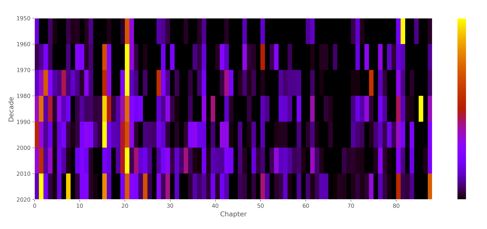
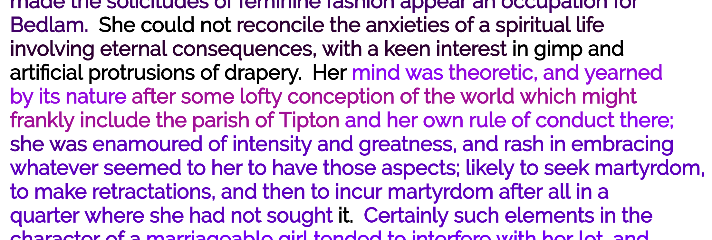

Text reuse detection technology and approximate text matching have made possible the large-scale computational identification of intertextuality. These technologies have often been used in plagiarism detection and in studies of journalistic text reuse (Bär, D. et al, 2012). Fewer studies, however, have applied these methods to humanities research. Our project uses this technology to analyze the precise location, density and chronology of citations of a source text, as a way to rethink and extend existing work on reception history. 

Our work develops a new methodology by applying text re-use detection to an under-researched realm: computational literary history. Like recent scholarship such as [The Viral Texts](http://viraltexts.org/) project and [Digital Breadcrumbs of Brothers Grimm](http://www.etrap.eu/digital-breadcrumbs-of-brothers-grimm/), we have used text-matching algorithms to trace the afterlife of a text (Büchler, M., et al., 2014; Ganascia, J.-G., 2014; Smith, D.A. et al, 2013; Smith, D.A. et al, 2014). These other projects focus on text genres without standardized conventions of citation. In contrast, our project applies similar methods to a text genre with standardized citation conventions, namely scholarly quotation. 

Other recent quantitative studies have taken articles in scholarly journals as the unit for analyzing literary history (Tenen, 2017; Goldstone and Underwood, 2014), and two recent JSTOR Labs projects visualize the reception of texts like [Shakespeare's plays](https://labs.jstor.org/shakespeare/) or the [U.S. Constitution](http://labs.jstor.org/constitution-site/) through passages cited in scholarly articles. Like these projects, we leverage the explicit and institutionalized nature of scholarly citation––verbatim quotation and attribution––in studying text-reuse patterns, in order to quantify scholars' attention and investigate the sociology of citation practices. 

Our project uses text-reuse technology to trace changes in when, how, and what scholars cite from a given text. We focus on a single text, George Eliot's *Middlemarch*, using an algorithm that matches tri-grams in *Middlemarch* to tri-grams in secondary scholarship on the novel, also calculating Levenshtein distances for fuzzy matching. We have worked with JSTOR Labs to assemble a corpus of around 2,000 articles in its collection that discuss _Middlemarch_. The figures below display results from this corpus.

Given that our methodology involves aggregating large amounts of data, our project examines which patterns emerge at different scales of aggregation. At the largest scale, Figure 1 shows the frequency of citations across the whole of _Middlemarch_ as a heat map segmented by decade, with yellow signifying the highest citation and black, no citations. The novel is broken into its chapters along the horizontal axis, and each segment is colored according to the number of times its text has appeared in the scholarly literature. Segments showing high frequency are relative to that decade.

Viewed chronologically, we see that scholarly interest in certain sections---as expressed in numbers of quotations---appears to shift over time. Although much less data is available from the 1950s and 1960s, we can nonetheless see that relative to that decade, scholarly citation appears concentrated on the end of the novel. In the 1960s and 1970s, most of the scholarly citation was concentrated at the start of the novel, but in the 1980s this shifted to the end, while in more recent decades it has been distributed more evenly, though still focused on the first half.

Figure 2 shows a finer grained analysis, no longer segmented by decade, displaying an excerpt from [our paragraph-level text browser for _Middlemarch_](https://lit-mod-viz.github.io/middlemarch-critical-histories/annotated.html). Here again, the color coding represents the density of quotations of each segments, ranging from unquoted black passages, to more frequently quoted purple and red passages. In this sample, the somewhat abstract contrast between "spiritual life" versus "gimp" and "drapery" has remained unquoted, whereas the definitive and punchy “her mind was theoretic” has been frequently quoted. This text browser allows us to visualize citation at the smallest scale. Having extracted the data on citations, we go on to investigate differences between specialist and non-specialist journals, most distinctive words over time, and other characteristics of quoted text.

Applying text reuse detection to study a work's afterlife in quotations has wide-ranging application across the humanities. Firstly, this methodology can be used in any discipline to investigate that discipline’s theoretical history. As with the 1980 study of Wundt's influence on the field of psychology (Brožek,  1980), our methodology could rapidly and easily produce similar investigations for the influence of Ferdinand de Saussure in linguistics, Pierre Bourdieu in sociology, Margaret Mead in anthropology, Simone de Beauvoir in feminist theory, and so on. This analysis would be much more fine-grained, registering not only the frequency of *works* cited but also specific sections, passages and even key phrases within them. 

By showing that this methodology provides new insights into *Middlemarch*, we provide a portable methodology as well as a theoretical reflection on the practice of quotation as it relates to the history of texts.

## References

**Bär, D., Zesch, T., Gurevych, I.,** (2012). "Text Reuse Detection Using a Composition of Text Similarity Measures." *Proceedings of COLING 2012* 1, pp. 167–184.

**Brožek, J.** (1980). “The Echoes of Wundt’s Work in the United States, 1887–1977: A Quantitative Citation Analysis.” *Psychological Research*, 42(1–2): 103–107.

**Büchler, M., Burns, P.R., Müller, M., Franzini, E., Franzini, G.,** (2014). "Towards a Historical Text Re-use Detection." In Biemann, C., Mehler, A. (eds.), *Text Mining, Theory and Applications of Natural Language Processing*. Springer International Publishing, pp. 221–238. 

**Ganascia, J.-G., Glaudes, P., Del Lungo, A.,** (2014). "Automatic detection of reuses and citations in literary texts." *Lit Linguist Computing* 29: 412–421. 

**Goldstone, A., Underwood, T.**, (2014). "The Quiet Transformations of Literary Studies: What Thirteen Thousand Scholars Could Tell Us." *New Literary History* 45: 359–384.

**Smith, D.A., Cordell, R., Dillon, E.M.,** (2013). "Infectious texts: Modeling text reuse in nineteenth-century newspapers." In *Proceedings of the 2013 IEEE International Conference on Big Data*. Santa Clara, CA: IEEE, pp. 86–94. 

**Smith, D.A., Cordell, R., Dillon, E.M., Stramp, N., Wilkerson, J.,** (2014). "Detecting and Modeling Local Text Reuse." In *Proceedings of the 14th ACM/IEEE-CS Joint Conference on Digital Libraries*. Piscataway, NJ: JCDL ’14 and IEEE Press, pp. 183–192.

**Tenen, D.** (forthcoming). "Digital Displacement." In Ursula K. Heise, Dudley Andrew, Alexander Beecroft, Jessica Berman, David Damrosch, Guillermina De Ferrari, César Domínguez, Barbara Harlow, and Eric Hayot (eds.), *Futures of Comparative Literature*,  London: Routledge.
