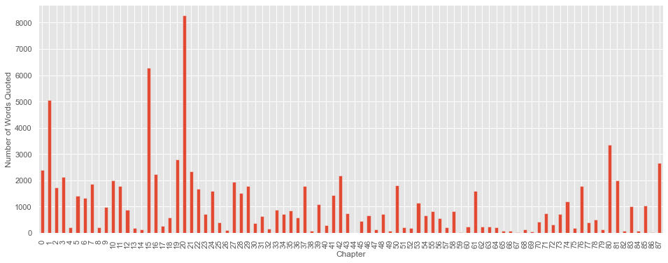
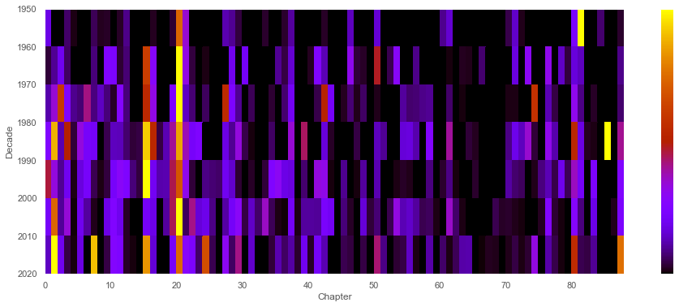
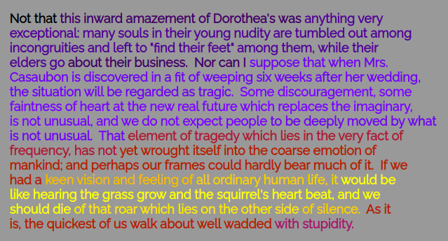

\doublespacing

# Abstract

Using text-reuse detection, we develop a tool for analyzing quotations from source texts in a body of scholarly writing. While text-reuse detection algorithms in general have been increasingly used within computational literary studies and adjacent computational fields, less attention has been paid to the specific challenges of using these algorithms to detect quotations from source texts. We use our tool to analyze quotations from a source text (George Eliot’s *Middlemarch*) within a collection of JSTOR-held scholarly writing in order to demonstrate the need for corpus-adapted text-reuse detection. By this we mean methods of text-reuse detection tuned to the text structures of specific corpora. Our methodology traces not only how and where a text has been quoted, but also enables a more granular analysis of what parts have been quoted and how this has developed over time. Bringing text-reuse detection together with rich bibliographic metadata, we showcase the strengths of this local, more corpus-specific method for identifying quotations.

# Introduction

Quotations, acts of plagiarism, instances of repeating gene sequences---these represent just a small fraction of the different kinds of objects that a researcher might be after when they look for instances of text reuse. Within the context of computational scholarship, text-reuse detection––-or the algorithmic identification of strings that appear in two sets of text––-has benefited from its ecumenical approach to texts. The ability to trace the reappearance of a portion of one text in another text is useful for understanding many humanistic domains that cite and use sources, from law to historiography, as well as in scientific realms such as genomics that deal with repetitive data sequences such as DNA. Such methods offer a wide range of disciplines the ability to trace instances of textual borrowing, replication or reuse.
 
Despite being applicable to a very broad range of objects, text-reuse detection as a method has often been deployed to answer a narrower research question: *is* there a possibility that portions of one text or corpus appear in another? Often the aim is to determine the possibility of plagiarism or textual borrowing. However, this assumption, and the assumption that identical methods can be used equally well for any text or corpus, have limited researchers' ability to effectively study text reuse for purposes other than detecting *covert* borrowing or plagiarism. Quotation, and quotation in scholarly writings in particular, is a kind of text reuse that is not secretive or concealed, and has distinctive conventions for signaling and demarcating reused portions of text, as well as norms around what properly counts as quotation in contrast to paraphrase (or plagiarism). Text-reuse detection methods developed to identify everything from genetic similarities to plagiarized computer code will have only limited success in detecting the distinctive text-reuse practice that forms the bedrock of much scholarly writing.

Quotation is particularly central to literary scholarship, where well-established disciplinary practices of close reading and textual exegesis give quotations from source texts a particular role in literary scholars' argumentation. As such, instead of asking *if* there's a possibility that one text includes portions of another (as in plagiarism detection), our study of scholarly quotation presupposes that most texts *do* quote from their sources. Based on this expectation, we develop a text-reuse detection tool adaptable to the given corpora. This tool offers fuzzy matching and hyperparameters that respond to typical features of coropora of scholarly writing, which a researcher can fine-tune to the specificities of their corpus and research question. While our case study is literary scholarship, the methods we outline for corpus-adapted text-reuse detection could apply (no doubt with modifications) to the conventions around quotation of sources in other disciplines across the humanities and social sciences. Our central argument is that using text-reuse detection to study scholarly quotations can be improved through methods that take into account norms and conventions of scholarly writing, and in turn will allow scholars to ask more nuanced questions relevant to their discipline and objects of study. Our preliminary findings, which analyze matches between George Eliot’s *Middlemarch* and thousands of scholarly writings from JSTOR, show the benefits of corpus-adapted methods in linking computational text analysis with disciplinary history.

# Background

Computational text-reuse detection has benefited from development in several specific domains. Plagiarism detection, a special use-case of text-reuse detection, was primarily developed to solve, as one 1981 work puts it, 'the problem of plagiarism in programming assignments by students in computer science courses' [@donaldson1981]. A computer science programming assignment, however, differs greatly from published scholarly writing. For one, whitespace and punctuation are significant. In addition, plagiarism detection typically looks either at whole-document similarity or locally replicated syntax (since variables can be renamed in code, or words can be replaced in a paper using a thesaurus). There have been several useful overviews of the state of the plagiarism detection problem, a long-standing problem in natural language processing [@lukashenko2007]. As plagiarism detection has grown into a multi-billion dollar industry, it has also become a lucrative commercial product as private companies have carried forward and developed its methods outside of the realm of scholarly or open-source research [@McMurtrieWhyPlagiarismDetectionCompany2019]. Both the ethics of plagiarism detection and the ethics of proprietary plagiarism software-––such as Turnitin-––have already received critiques for both the simplistic understanding of plagiarism and its murky retention of student and instructor intellectual property.

Text-reuse detection has also been used in genomics and bioinformatics generally. The task of gene sequencing has led to the use of sequence alignment algorithms, which have undergone various developments over the years [@heng2010]. Given two strings of genetic sequences comprising cytosine [C], guanine [G], adenine [A] and/or thymine [T], the algorithm aligns them, such that the common parts of the sequence have identical indices.

One of the most well-known gene sequence alignment algorithms is BLAST (Basic Local Alignment Search Tool) from 1990 [@altschul1990basic]. As with plagiarism detection, this problem differs greatly from that of scholarly quotation, in that the possible elements are completely consistent and few in number (A|C|G|T). With quotation from literary sources, the elements to be sequenced potentially include every word in a language. Moreover, verb and noun forms may be changed in order to fit the scholar's syntax ('he was "descend[ing] down the staircase'''), variant spellings may appear (because of British vs American English, because of historical vs modernized spellings) and, since human memory is involved, even misquotations sometimes make it into print.

In the early 2000s, methods for studying text-reuse began to make their way from plagiarism detection and bio-informatics into computational linguistics. Some of the early methods were oriented around tracking the reuse of newswire stories from the AP or Reuters in other newspapers [@CloughMETERMEasuringTExt2002; @SeoLocaltextreuse2008; @BarTextReuseDetection2012] or the study of plagiarism communities [@KhritankovDiscoveringtextreuse2015], while others developed methods for detecting repeated sequences of text incidentally, as part of generating hyperlinks between different parts of the Google Books corpus [@KolakGeneratingLinksMining2008].

Text-reuse detection has, more recently, been used by scholars to identify communities produced by the reprinting of texts, particularly in newspapers and periodicals. In their work on the Viral Texts Project, Ryan Cordell, David Smith, and Elizabeth Maddox Dillon have shown how reprinted poems, ads, and short news articles in 18th-and 19th-century American newspript can illuminate patterns in newspaper syndication [@SmithInfectioustextsModeling2013; @SmithDetectingModelingLocal2014]. Their work has paved the way for other scholarship on reprinting, including newspapers in other languages, [@VesantoApplyingBLASTText2017; and @VesantoSystemIdentifyingExploring2017 both apply the BLAST algorithm to Finnish newspapers in the 18th-19th century] and towards different aims, like tracing the recirculation networks of newswire copy in the corpora of 21st-century news articles from the US and the UK [@NichollsDetectingTextualReuse2019]. In a similar vein as text-reuse in literary studies, computational linguistics have used similar methods in examining how the text of a given policy document is reprinted in other bills and legislative texts [@LinderTextPolicyMeasuring2020]. Here, while occasional attention is paid to the particular texts that 'go viral,' the focus is not on particular passages but on the networks of publishers, syndicators, and editors that such acts of reprinting reveal. 

Early examples of literary scholarship that used text-reuse detection were modeled after these gene-sequencing and plagiarism detection methods and, as a consequence, text-reuse methods were shaped around a particular problem: identifying any instances of potential similarity between two collections of texts.^[We might contrast the assumptions of text-reuse detection with textual versioning and collation methods, like `git diff`. While `diff` assumes that texts will be near identical: they will share text and word or with a few small variations, text-reuse detection presumes that two texts will be mostly different, with very few shared n-grams.] Scholars were chiefly interested in the potential evidence of literary borrowing, using BLAST algorithms to find evidence that eighteenth-century reference texts borrowed passages from Diderot's and D’Alembert's encyclopedias, [@OlsenSomethingBorrowedSequence2011] or whether 19th-century French writers like Balzac and Gautier plagiarized from one another [@GanasciaAutomaticdetectionreuses2014]. 

When computational studies have focused on quotation, they have typically focused on quotation of passages from canonical source texts (often, texts from Greek and Roman antiquity or the Hebrew or Christian Bible) in other non-scholarly texts such as newspapers or novels [@GessnerBiblicalintertextualitydigital2013]. Lincoln Mullen, in America's Public Bible, focuses on quotations from the Old and New Testaments of the Bible in a corpus of American 18th- and 19th-century newspapers [@LincolnAmericaPublicBible; @QuotationFinderAmerica2022]. Marco Büchler’s TRACER project offers something of a hybrid between the study of particular quotations and their circulation: TRACER focuses on reprinting of Classical Greek authors within a corpus of Greek historian’s reference texts and takes frequent quotation as a metric for a work’s 'influence.' [@BuchlerMeasuringInfluenceWork2013; @KokkinakisDetectingReuseBiblical2016; see also Frederik Arnold's 'Lotte' (later renamed 'Quid') framework @ArnoldLottev12022; @ArnoldQuid2022; @ArnoldLotteAnnetteFramework]. Detecting quotations within texts poses particular challenges: what edition and translation of the Bible to use, or how to deal with slight misquotations [@DuhaimeTextualReuseEighteenth2016; @RoeDiggingECCOIdentifying2016]. Recent work has also begun to extend text-reuse methods to non-Latin scripts [@SturgeonUnsupervisedidentificationtext2018; @Budakdirectphonologydphon2021; @Budakdphon2022].

A related but distinct area of scholarship to the study of text reuse is the study of *citations*, which often goes by the name 'bibliometrics.' Whereas quotation involves the verbatim replication of some portion of the source text, citation involves only a reference. In the case of scholarly writings, this is usually a bibliographical reference formatted according to a citation style determined by the publisher. For example, to *cite* Michel Foucault’s concept of the 'author-function' or the article 'What is An Author?' from which it derives is distinct from quoting his specific formulations within the article. Citations have particular significance for scholars within the contemporary university, where they are a widely-used metric that shape career opportunities. Many decades of research have demonstrated that the distribution of citations in academia replicates and reinforces broader inequalities related to social categories like gender and race. [See e.g. @FerberCitationsAreThey1986; @EarhartCitationalPoliticsQuantifying2021; @CiteBlackWomenCollectiveCiteBlackWomen]. Focused as they are on the social status of the cited works’ authors, these studies don’t typically examine the smaller scale of which portions of a work are cited [See @RomanelloExploringCitationNetworks2016 for an exception, which also analyzes the book and line numbers included in citations of classical texts like Vergil’s *Georgics*]. Methodologically, all these studies function not by detecting text reuse but by tallying bibliographical references, which in scholarly writing have a relatively consistent form (e.g. in-line citations; footnotes; endnotes; list of works cited). In contrast, our method detects instances of text reuse, whether accompanied by a bibliographical reference or not, and doesn’t detect bare citations without quotation. While bare citation is the norm in certain natural sciences, across the humanities and in literary studies in particular, quoting from and citing a source are both options, whose dynamics we want to understand better. It may be, for example, that whom scholars choose to quote, as opposed to merely cite, further intensifies the social inequalities already well-documented in citation patterns.^[Literary scholars have also studied quotation practices using various non-digital methods. Studies focusing on the presence of quotations in literary works include @MeyerPoeticsQuotationEuropean2015; @CompagnonSecondeMainOu1979; @PrinsVictorianSappho1999; @BuurmaEpigraphsMatter2012; and @HackReapingSomethingNew2016. Studies of how portions of literary texts have circulated in the form of quotations include @GarberQuotationMarks1999; @PriceAnthologyRiseNovel2000; @DamesNotCloseReading2010a; and @MoleWhatVictoriansMade2017. Closest to our own project, there have been several recent (non-computational) studies examining how *literary scholars* quote: @AuyoungWhatWeMean2020 and @KramnickCriticismTruth2020.]
 
Our text-matcher builds on these existing bodies of work by developing methods geared towards a more specific research task: detecting quotations from source texts used in scholarly writing. Text-reuse detection in the contexts of plagiarism or networks of reprinting cast a wide net (i.e. set the threshold for detecting reuse lower) in order to capture as many potential instances as possible, which can then be further investigated manually as needed. In contrast, our methodology sets the threshold higher, since scholarly norms presuppose precise replication in quoted texts, with only limited variants permissible. In focusing on the quotation of source texts within scholarship, we build a tool with the aim of identifying quotations in corpora (scholarly writings) that have more standard conventions for direct quotation. In doing so, we take inspiration from several recent digital projects studying scholarly quotation patterns in aggregate. JSTOR Labs and Derek Miller have analyzed quotations from literary texts in scholarly writings: both projects present interactive web visualizations for exploring what lines have been most quoted within Shakespeare’s corpus [@HumphreysHowJSTORLabs2017;@MillerQuoteNotQuote]. Our text-matcher has been used in the study of other corpora, most notably in @PiperMeasuringUnreading2020 to study quotations of Goethe’s corpus. ^[While we were conducting these experiments, and presenting our initial findings at Digital Humanities 2017, we learned that the Stanford Literary Lab was working on a strikingly similar problem: text matching between a large corpus of literary texts, and a corpus of historical book reviews and critical writings from the British Periodicals Online collection. The Stanford Literary Lab independently arrived at many of the same parameters we use for text matching, even using the same Python library.]

# Methods

We begin by pre-processing a text into a sequence of tokens (roughly, words). We strip out punctuation and extraneous whitespace, and lowercase the text. We also concatenate hyphenated words, in order to match against words which have been hyphenated due to coincidental line breaks in the scholarly publication. We also remove the NLTK’s standard stopword list, consisting of the most commonly-occurring words such as 'of' and 'the.'[^02] From there, we convert the tokens into stems––-for example, 'photography' and 'photographer' both become the stem 'photog'––-using the Lancaster stemmer of the NLTK, which uses the Paice-Husk stemming algorithm [@nltkLancaster;@paice1990]. We chose this stemmer, after evaluating several other options, because the stems it produces retain a recognizable word form while collapsing small variations in noun and verb endings. Finally, we group these stems into n-grams---three-token sequences, or trigrams, by default---allowing us to alleviate the computational work required of the SequenceMatcher.

[^02]: Notably, this pre-processing removes quotation marks, which could offer another method for detecting quotations. However, we have not relied on this method since automated parsers are not very accurate at identifying material inside quotation marks. In addition, much of the scholarship in JSTOR’s corpus, and in searchable databases of scholarly writings in general, has been digitized through Optical Character Recognition (OCR), which can both mis-recognize actual quotation marks and erroneously insert them.

The core matching algorithm we use is the SequenceMatcher from the Python library Difflib [@peters_difflib_2016], which adapts Ratcliff/Obershelp Pattern Recognition, or 'gestalt pattern matching' [@ratcliff1988pattern]. This computes the string similarity $D_{ro}$ of strings $S_1$ and $S_2$ according to their matching tokens $K_m$:

$$ D_{ro} = \frac{2K_m}{|S_1|+|S_2|} $$

This computes the initial, or core matches. By default, we search for a core match of length three, `--threshold=3` in the command line interface. This amounts to three *overlapping* trigrams---a total of five words. Thus, we define the minimal quotation as five identical stems. We arrive at this set of defaults after a long period of experimentation: too little of a threshold, we discovered, results in too many false positives, since there are many common three- and four-word sequences which are set phrases of the English language, rather than evidence of quotation. This core matching process must involve identical stems---given the origins of the Ratcliff/Obershelp algorithm in bioinformatics---which gives higher initial performance compared to a fuzzier matching procedure.

However, the initial threshold only constitutes the first step of the matching operation. From there, we perform two additional functions, both of which are much slower, computationally. The first is to extend the match to contiguous words which may also be part of the same quotation. To do that, the algorithm looks [one word/token?] backwards and forwards from the boundaries of our initial match, and compares the words at these boundaries in both the source text and scholarly text. To compare these words, we use Levenschtein distance, or edit distance, which describes the number of insertions, deletions, or substitutions required to edit one string into another[@levenshtein1966binary]. When adjusted for the number of letters in each word, we can approximate a word's morphological similarity to another. So long as two words have an edit ratio of 0.4 or below, we consider them part of the same quotation. This allows us to handle differences in American and British spelling, as well as some OCR errors. Considering these example edit ratios:

| Word A  | Word B   | Edit ratio |
|---------+----------+------------|
| color   | colour   |     0.1818 |
| theater | theatre  |     0.2857 |
| day     | today    |        0.5 |
| foobar  | foo56bar |     0.2857 |

The edit ratios of the words with divergent British and American spellings are below the threshold and are considered matches; the similar words *day* and *today* are above the threshold and aren't considered matches. The word with OCR errors, *foo56bar*, is still considered a match.

Even with this additional step, however, we noticed that the algorithm was breaking off before achieving a complete match, for example when the number of OCR errors surpassed this threshold, or when the scholarly text was interrupted by paratextual features, like running headers or page numbers. To mitigate these issues, we heal neighboring matches. If two matches are within eight tokens of each other, we concatenate them into the same match. This allows us to match strings across page breaks, matching, for instance, a string such as 'hearing the grass grow and the squirrel's heart beat' with 'hearing the grass GEORGE ELIOT--GEORGE HENRY LEWES STUDIES 54 and the squirrel's heart beat, and we should die of that roar which lies on the other side of silence.' Without this healing of neighboring matches, the match on the first page would be smaller than the minimum match size.

Because scholarly writings held in databases such as JSTOR are accompanied by detailed metadata relevant to scholars (e.g. publication date, journal/book title, page ranges), we designed our tool to integrate this metadata. In particular, metadata on publication dates allows us to analyze not only where in the text a particular quotation appeared (determined through a simple text processing to determine the index characters of each chapter in our sample text), but how quotation patterns varied over time within our corpus (in our case, a collection of 20th and 21st century scholarship from JSTOR). Extracting the dates from the metadata, we developed a method for diachronic analysis: analyzing what passages were quoted at different moments over time. This diachronic analysis allows the detection of quotation patterns to open out onto questions of disciplinary history.

# Results and discussion

What our results show is the importance of corpus-adapted specific text-reuse detection methods. Our algorithm and workflow is designed for a specific case and tuned with hyper-parameters that are sensitive to the nature of a quotation in a scholarly text, offering a more nuanced method for humanities-specific applications.The modifications of our algorithm are designed to capture particular ways that scholarly texts quote their sources. Take, for instance, this quotation that our healing of neighboring matches was able to correctly identify:

> **Passage in *Middlemarch***: Bulstrode's sickly body, shattered by the agitations he had gone through since the last evening
 
> **Passage in scholarly text**: Bulstrode's 'sickly body' is 'shattered by the agitations he had gone through since the last evening'[@CarpenterMEDICALCOSMOPOLITANISMMIDDLEMARCH2010, 521]
 
Using healing, we're able to account for some of the ways that scholars weave direct quotations from other texts into their own, modifying the direct quotation to fit the syntax, style, mood, and tense of their own sentences  [@KramnickCriticismTruth2020, 223]. In other instances, our fuzzy matching parameters and our healing were able to heal across instance of hyphenation ('ac-commodate' is correctly identified as one word)  [@MilletUnionMissBrooke1980, 40]. The tool even detects text that was not presented as part the quotation but had been naturalized into the scholar's own language:
 
> **Passage in *Middlemarch***: 'growing good of the world is partly dependent on unhistoric acts; and that things are not so ill with you and me as they might have been, is half owing to the number who lived faithfully a hidden life, and rest in unvisited tombs.
 
> **Passage in scholarly text**: The narrator asserts that 'the growing good of the world is partly dependent on unhistoric acts.' If things are 'not so ill ... as they might have been,' Eliot concludes, it is 'half owing to the number who lived faithfully a hidden life, and rest in unvisited tombs' [@meckier1978arduous, 228, text reuse outside quotation marks underlined.]

Because our text-matching algorithm has been designed to be customizable, all of the hyperparameters can be changed and customized depending on the given corpus, providing more opportunity for fine-tuning. In our case study, we’ve set our parameters to be fairly strict. Our text-matching algorithm makes intentionally conservative matches in order to avoid mis-identifying a commonly-used string of text as a quotation. This means that we have extremely high precision (100% of the quotations our text matcher identified in a random, human-verified sample were in fact quotations from our source text). But setting the precision so high also comes with some tradeoffs: recall was only 30%, meaning the tool failed to detect 70% of quotations that are 5+ words in length. Other researchers––depending on their corpus and research questions–– may be interested in lowering the precision score in order to achieve higher recall.

We set the matcher to identify sequences of three matching overlapping tri-grams. In practice, therefore, the shortest sequence of text that it can identify is a string of 5 words long. We’ve set this parameter relatively high because we found that matching shorter strings did not guarantee that the matched string did in fact come from *Middlemarch*, as opposed to a commonly occurring phrase. To illustrate the problem, 'to make a long story short' is a 4-gram (once stopwords are removed) which in any given case might be a quotation from a source text or might be a scholar using the idiom themselves. Moreover, stopwords become more problematic at shorter length: we’ve found scholars quoting the phrase 'you and me' from the final sentence of *Middlemarch*, a phrase consisting entirely of stopwords. In short, our analysis shows that detecting quotations under 5 words in length is a more complicated task that requires quite distinct methods.^[Determining the probability of a given word in a general corpus could help capture some shorter phrases containing uncommon words, but would miss common n-grams like 'you and me.' An algorithm that searched for repetitions of shorter portions of passages already quoted would also help capture a common practice we’ve called 're-quotation,' in which scholars present a block quote and then re-quote smaller parts of it in ensuing sentences.]

As previously stated, the experiment for which we developed text-matcher was an analysis of scholarly quotations of George Eliot's novel *Middlemarch*. We were interested in knowing how *Middlemarch* was quoted over time, and whether there were patterns to these quotations. Thanks to JSTOR Labs, we obtained full texts of over 4,000 scholarly writings which contain the word 'Middlemarch.' (The uniqueness of this novel's title helped us greatly in this query.)
 
Since text-matcher keeps track of the locations of matches, we are able to answer a number of questions about trends in the scholarly quotation of *Middlemarch*. One of our early motivating research questions was, which parts of the novel have been quoted the most frequently. @Fig:byChapter shows the frequency of quotations per chapter, a convenient unit for subdividing this very long novel. The most quoted chapter, in terms of both number of quotations and number of quoted words, is Chapter 20.

{#fig:byChapter}

Next, we set out to discover the histories of these quotation patterns, by grouping them by year of publication. @Fig:byChapterDiachronic shows the same breakdown of quotations per chapter, but shown across seven decades. What we found surprised us—with the exception of Chapter 20, which has remained the perennial favorite among scholars, other chapters have rises and falls over 20- to 30–year cycles, becoming more quoted for a time, and then gradually less quoted.^[Given the precision and recall described above, our positive matches are highly reliable data, but we want to avoid making claims about the absence of matches. Nonetheless, our manual check of a subset of 56 items suggests that the data-matcher’s false negatives weren’t biased towards particular parts of the novel.]

{#fig:byChapterDiachronic}

We discovered that Chapter 20 is the most-quoted chapter, due to large numbers of quotations of its fifth and sixth paragraphs. This led us to develop an even more granular visualization of quotation patterns: we created [a text browser](https://lit-mod-viz.github.io/middlemarch-critical-histories/annotated.html), in which passages are colored according to the relative number of quotations: darker-colored passages are less quoted, and lighter-colored texts are more quoted. @Fig:annotated shows a screenshot from this text browser, showing the most quoted passage in the novel, from Chapter 20.

{#fig:annotated}

Our inspiration for this browser comes from JSTOR's *Understanding* series. When we began our project, JSTOR had produced browsable texts of Shakespeare plays and the US Constitution, annotated according to the number of JSTOR text quoting from them. There are now many more texts available for exploration, including *Middlemarch*. But while JSTOR's browser provides paragraph-level counts of quotations, our analyses are accurate to the character level. This enabled us to find, for example, that of this most-quoted sentence above, its beginning, 'if we had a,' is quoted much less than the rest of the sentence.

Our findings on the 'squirrel's heart beat' passage led us to investigate whether there were any patterns to quoted phrases. We thus tallied all the words that appear in quotations, weighted them according to numbers of quotations, and compared these word frequencies to the words that didn't appear in our matches. The words most distinctive of our quoted passages were, in order, *life, like, woman, dorothea, love, world, soul, consciousness, little, sort, deep, live, nature,* and *history*. Apart from the protagonist's name, Dorothea, the rest are chiefly abstractions. This leads us to ask whether scholars are drawn to quote passages that contain abstract claims---for example claims about *life, love,* or the *soul*---because they provide a more general purchase on a text than, say, a one-off plot point or a detail from a description. Individual scholars may of course quote plot points or descriptions, but collectively the shared reference points are likely to be more abstract. ^[Stanford's Literary Lab has found similar patterns of quoted words within the British Periodicals Online corpus.]

We offer these results not as definitive of *Middlemarch*, let alone of scholarly quotation in general, but as an indication of the kinds of research questions concerning textual history and disciplinary practices that text-reuse detection can open onto. The results also show the symbiosis between methods and findings: our adaptations to the specificities of scholarly quotation gives us better results, whose advantages and limitations we understand more precisely, and examining the results prompts methodological refinements, as well as awareness of quirks that may be particular to a given source text or scholarly writer.

# Conclusion

In this article, we've shown the importance of corpus-adapted studies of text reuse, using our case study in literary scholarship of a single source text (George Eliot's *Middlemarch*) and a corpus of JSTOR's scholarly writings. We've adapted our workflow to this corpus by tuning hyperparemeters like edit distance and number of n-grams matched on to reflect the particular conventions of quotation post-1945 scholarship. Our goal has been to provide a workflow for others to study quotations from source texts in corpora of scholarly writings, and to provide a clear pipeline for others using which is available for use on our GitHub repository. While we continue to refine our matching algorithm, our goal has been to illustrate some of the parameter tuning that comes with detecting quotations within a humanities field where quotations compose a significant portion of scholarly writings. Our case study has been in literary studies, but we urge digital humanists of all disciplines to make corpus-specific adaptations in their text-reuse detection studies. Text-reuse detection isn't one-size-fits-all. More speculatively, our workflow might be adapted to other corpora with other conventions: for instance, instances of text from an early modern medical treatise like Burton's *Anatomy of Melancholy* quoted within eighteenth-century scholarship (where differences in OCR quality and typographical conventions like the long s might require a fuzzier edit distance). Or we might imagine instances where a source text is highly repetitious, where and additional level of tuning would be required to determine which one of several instances in of phrase in a text is being quoted.  In the case of Middlemarch, there are few quotations that would be repeated text. You would need to adapt to a specific corpus if the source text is one where there is lots of repetition.  Or we might imagine instances in a smaller corpus, say, quotation from a piece of legislation in a another legal text, where it might matter to identity quotations smaller than five words, and where scholars might construct a probability table examining the likelihood of a given n-gram in the larger corpus. Without exhaustively listing the different kinds of corpora or conventions, our hope is to provide a foundation and clear workflow for adapting to more localized methods for studying text-reuse.

# Acknowledgements

For their support on this project, we thank Dennis Yi Tenen, Alex Gil, Roopika Risam, the Literary Modeling and Visualization Workshop at Columbia University, and the contributors to the text-matcher open source project.

\theendnotes

# References

